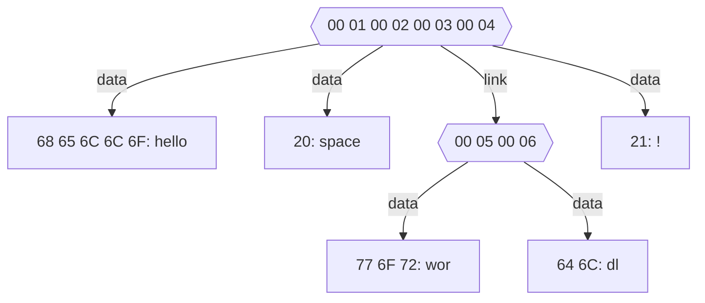

## the Chunck Transfert Protocol

the chunks
|CRC 32: 4 octets|protocol: 'Ch'|version: 1 octet|ID: 1 octet|type: 1 octet|lenght: 4 octets|data|
|----------------|--------------|----------------|-----------|-------------|----------------|----|

- protocol: SP
- version: the version of the SP
- lenght: the lenght is in ascii and is limited by a ';'

types:
* 0x00: id redirect   : can contain multiple ids
* 0x01: data          : contains data
* 0x02: compress data : contains compressed data

example: hello world!
|protocol|CRC        |version|ID   |type|lenght |data                   |
|--------|-----------|-------|-----|----|-------|-----------------------|
| 43 68  |BC BE FD FD|  01   |00 00| 00 | 00 00 |00 01 00 02 00 03 00 04|
| 43 68  |36 10 A6 86|  01   |00 01| 01 | 00 00 |68 65 6C 6C 6F         |
| 43 68  |E9 6C CF 45|  01   |00 02| 01 | 00 00 |20                     |
| 43 68  |CE EC B8 C2|  01   |00 03| 00 | 00 00 |00 05 00 06            |
| 43 68  |9E 6B FF D3|  01   |00 04| 01 | 00 00 |21                     |
| 43 68  |F2 91 C0 BF|  01   |00 05| 01 | 00 00 |77 6F 72               |
| 43 68  |04 4C 91 2F|  01   |00 06| 01 | 00 00 |64 6C                  |



## Chunky !!!

### command:
#### get
get a chunk from a server
```
Chunky get < ip addr | site name > < port (defalt :1500) >/< path >#< chunk id (if not set get all chunks like getA) > < path to output file >
```

#### getA
get all chunk from a server
```
Chunky get < ip addr | site name > < port (defalt :1500) >/< path > < path to output file >
```

#### FTC
File To Chunks
transform a normal file into a Chunked file
```
Chunky FTC < path to input file > < path to output chunks folder >
```

#### CTF
Chunks To File
transform a Chunked file into a normal file
```
Chunky CTF < path to input chunks folder > < path to output file >
```

### chunk folder
struncture:
< file name : directory >
    ┣ < chunk id : file >
    ┖ < chunk id : file >

example:
MyIncredibleFile
    ┣ 0
    ┖ 1